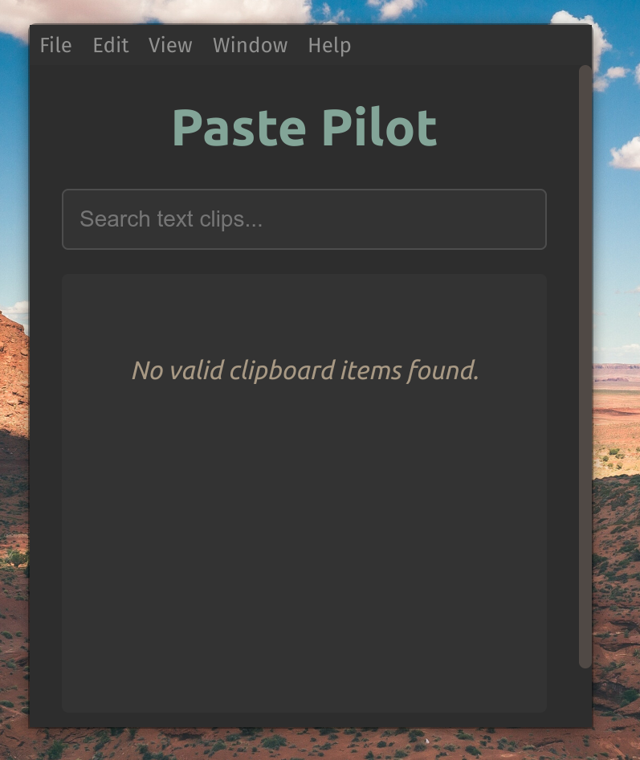

# Paste Pilot


A minimal clipboard manager for Linux built with Electron.

## Features

- 📋 Track clipboard history for both text and images
- 🔍 Search through text clipboard entries
- ⌨️ Quick access with Ctrl+Alt+V global shortcut
- 🖼️ View and reuse clipboard images
- 💾 Persistent clipboard history between sessions
- 🔄 Real-time updates as you copy new content
- 🪶 Lightweight resource usage

## Installation

### Option 1: Download Release Files

Download the latest release from the [GitHub Releases page](https://github.com/vatsal-darji/paste-pilot/releases).

**For .deb (Debian, Ubuntu, etc.)**:
```bash
sudo dpkg -i paste-pilot_1.0.0_amd64.deb
```

**For AppImage**:
1. Make it executable:
   ```bash
   chmod +x Paste_Pilot-1.0.0.AppImage
   ```
2. Run it:
   ```bash
   ./Paste_Pilot-1.0.0.AppImage
   ```

### Option 2: Build from Source

```bash
# Clone the repository
git clone https://github.com/YourUsername/paste-pilot.git
cd paste-pilot

# Install dependencies
npm install

# Run the application
npm start

# Build the application
npm run build
```

## Usage

1. **Launch the App**: Start Paste Pilot from your applications menu or run it from the terminal
2. **Using the Clipboard**: Copy text and images as you normally would
3. **Access History**: Press `Ctrl+Alt+V` to open the clipboard history window
4. **Search**: Type in the search box to filter text entries
5. **Reuse Content**: Click on any entry to copy it to your clipboard
6. **Delete Items**: Click the delete button to remove an entry from history

## Screenshots



## Development

This application is built with:
- Electron
- JavaScript
- HTML/CSS

### Project Structure

```
paste-pilot/
├── src/
│   ├── assets/
│   │   └── clipboard.png
│   ├── main/
│   │   └── main.js
│   └── rederers/
│       ├── index.html
│       ├── styles.css
│       └── renderer.js
├── preload/
│   └── preload.js
├── package.json
└── README.md
```

## Contributing

Contributions are welcome! Please feel free to submit a Pull Request.

1. Fork the repository
2. Create your feature branch (`git checkout -b feature/amazing-feature`)
3. Commit your changes (`git commit -m 'Add some amazing feature'`)
4. Push to the branch (`git push origin feature/amazing-feature`)
5. Open a Pull Request

## License

This project is licensed under the MIT License - see the LICENSE file for details.

## Contact

Vatsal Darji - vatsaldarji11@gmail.com

Project Link: [https://github.com/vatsal-darji/paste-pilot](https://github.com/vatsal-darji/paste-pilot)
